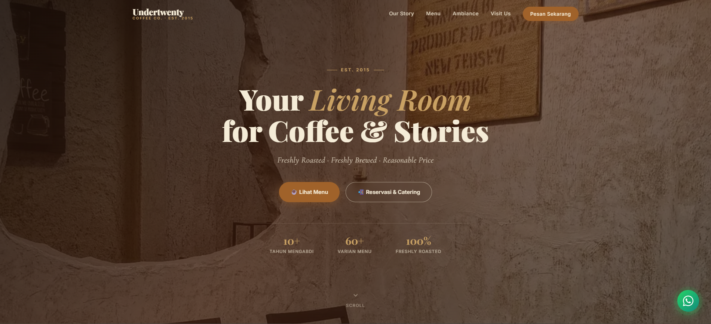
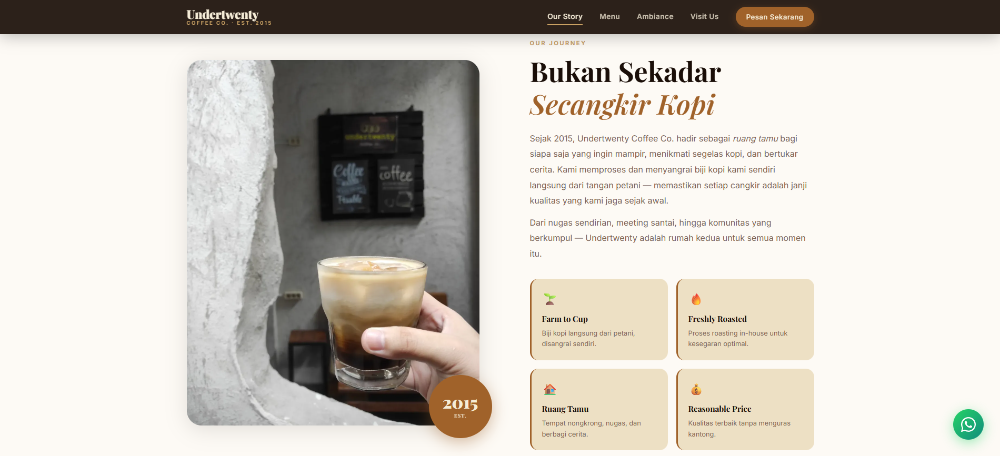
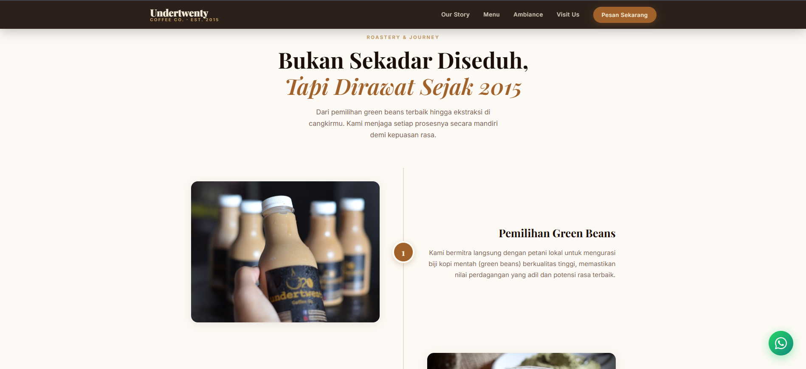
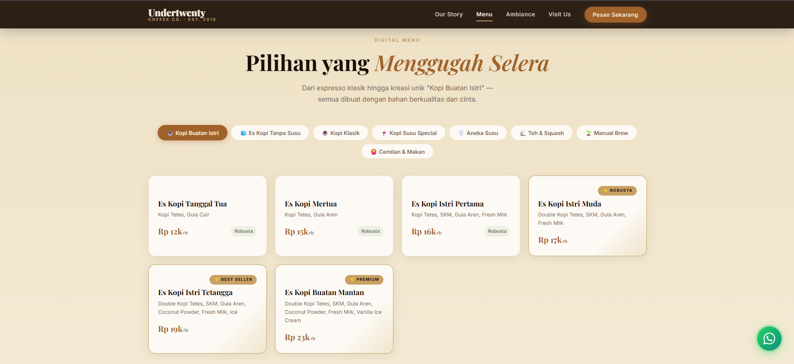
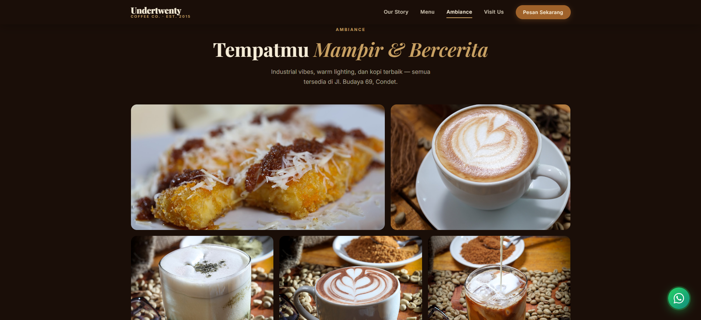
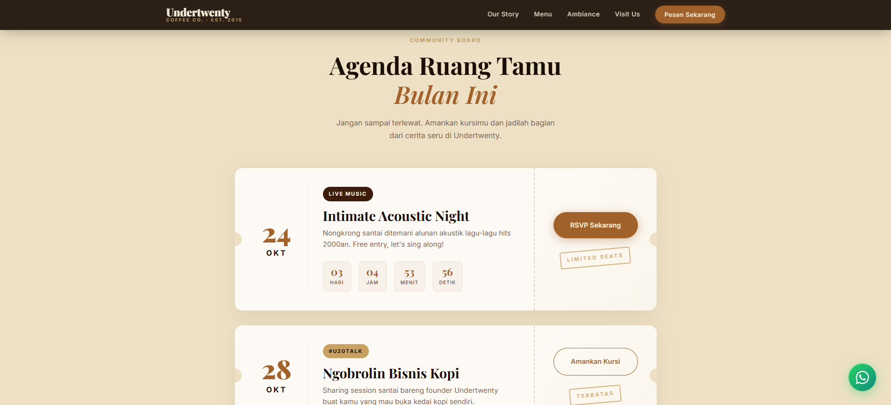
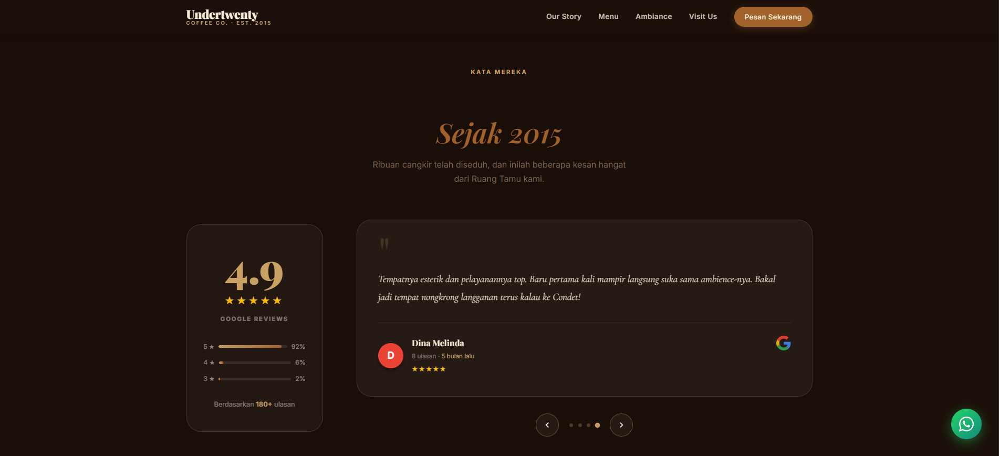
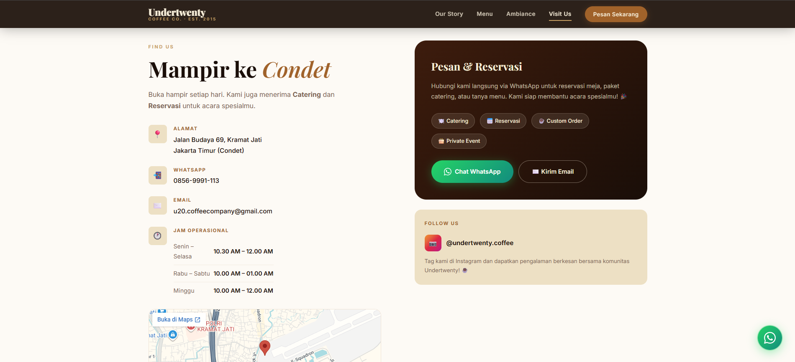

# Undertwenty Coffee Co. <br> Freshly Roasted, Freshly Brewed ☕

<p align="center">
  
</p>

> **"Your Living Room for Coffee & Stories"**
> Indonesian coffee house berbasis di Jakarta Timur (Condet) yang telah berdiri sejak 2015. Menyajikan racikan kopi *manual brew*, es kopi susu otentik, serta camilan lokal dalam suasana ruang tamu yang hangat dan nyaman.

---

## 📸 Tampilan Antarmuka (UI Previews)

Website ini dirancang secara khusus untuk memberikan pengalaman **Premium, Responsif, dan Interaktif**. Setiap bagian *(section)* halaman digarap dengan animasi yang halus dan komposisi elemen yang elegan.

### 1. Hero & Navigation
Navigasi transparan yang cerdas dengan efek solid saat di-scroll, dipadukan dengan tayangan awal (*Hero Image Carousel*) yang otomatis bergeser, membawa estetika dan kesan profesional sejak detik pertama.

<p align="center">
  
</p>

### 2. Our Origin & Journey (About Us)
Bercerita kisah perjalanan *(journey)* lebih dari sedekade dengan efek kemunculan elemen berbasis *scroll* (Scroll Reveal) dan paralaks (*parallax*).

<p align="center">
  
  
</p>

### 3. Interactive Digital Menu
Menu digital inovatif dengan Filter Tab (*Es Kopi Susu Istri, Klasik, Non-Kopi, dsb.*), dilengkapi indikator label "Rekomendasi" maupun "Premium". Semuanya ter-render murni menggunakan modular *JavaScript Vanilla*, sehingga pembaruan harga atau menu ke depannya dapat dilakukan semudah mengedit kamus JSON.

<p align="center">
  
</p>

### 4. Ambiance & Community Board
Kumpulan galeri visual dari arsitektur ruang kafe dan suasana ngopi. Dilengkapi juga dengan infografis papan komunitas dan info keikutsertaan *membership*.

<p align="center">
  
  
</p>

### 5. Cerita Pelanggan (Reviews)
Sebuah area *Social Proof* premium berlatar warna *espresso* solid yang menampung rangkuman statistik Google Review (Rating Akhir 4.9). Dilengkapi dengan efek slider interaktif yang menyorot *quote* dari berbagai pelanggan reguler (diatur tanpa plugin eksternal melainkan `setInterval` optimal yang bisa otomatis berjeda jika *tab* sedang tak aktif berkat *Page Visibility API*).

<p align="center">
  
</p>

### 6. Reservasi & Lokasi (Find Us)
Footer elegan berisi integrasi reservasi melalui WhatsApp, Google Maps *iframe* (dengan fitur `loading="lazy"`), serta keterangan detail jadwal buka tempat.

<p align="center">
  
</p>


---

## 🛠️ Stack Teknologi & Fitur Unggulan

Proyek ini sengaja dibangun tanpa bergantung pada _framework_ berat (seperti React/Vue). Mengandalkan keaslian standar Web modern untuk kecepatan yang maksimal:

- **HTML5 Semantic:** Terstruktur rapi, *accessible* bagi *screen reader*, terintegrasi *Schema LocalBusiness (JSON-LD)*.
- **CSS3 Klasik (Tanpa Preprocessor):** 2.000+ baris kode teroptimasi. Memanfaatkan CSS *Variables* (`var(--gold)`, `var(--espresso)`) secara masif untuk menjaga keharmonisan warna, kalkulasi `clamp()` untuk responsivitas tipografi tanpa *media query* berlebih, dan *CSS Grid & Flexbox* yang kompleks.
- **Vanilla JavaScript (ES6):** Performa tanpa halangan (`0 dependensi/0 npm packages`). Mengontrol semua animasi (Observer API), Carousel, dan perenderan Menu digital.
- **Micro-Animations & Hardware Acceleration:** Semua transisi memanfaatkan atribut transform/opacity agar proses *rendering* langsung dieksekusi oleh unit kartu grafis / GPU komputasi klien, bukan *Main Thread* CPU.

---

## 🚀 Keamanan (Security) & Kinerja (Performance)

Aplikasi **Static Landing Page** ini tidak terbatas pada sisi visual, melainkan sudah dipersenjatai dengan arsitektur lapis baja bertaraf IT Agensi Profesional:

1. **Anti-SQLi & Zero RCE:** Skema aplikasi statis (Web 1.0 architecture) sama sekali membunuh risiko serangan eksploitasi Server-Side.
2. **CDN Architecture Ready:** Konfigurasi khusus untuk *Vercel/Netlify* telah dibuat melalui file `vercel.json` atau `_headers` yang menerapkan parameter tegas lapis keamanan:
   - `Strict-Transport-Security` (Untuk mengamankan jembatan HSTS).
   - `Content-Security-Policy` yang dikonfigurasi selektif.
   - `X-Frame-Options` untuk mencegah *Clickjacking*.
3. **Smart Power Saving (Visibility API):** Mencegah efek pemanasan baterai *smartphone* pengguna berkat implementasi skrip *Observer* di dalam `main.js`. Jika *tab browser* berpindah dari (*out-focus*), semua proses animasi memori (seperti Hero Slider / Reviews) akan dijeda (paused).
4. **Optimasi Gambar Global (.webp):** Merobak seluruh format aset *png/jpeg* kuno menjadi _Next-Gen Format_ yang dikompres hingga rasio >85% namun tetap mempertahankan kualitas visual yang HD. Gambar dikonfigurasi dengan *lazy mapping*.
5. **SEO & Struktur Audit A+:** Meta data tersusupi lengkap struktur pemetaan `og:title`, `og:image`, dan `twitter:card`. Tidak ada *placeholder texts* semacam *Lorem Ipsum* atau komentar cacat *TODO* tersisa. 

---

## 💼 Panduan Pengembangan & Cara Memulai (Running Local)

Jika Anda developer atau pengembang selanjutanya, sangat mudah menjalankan proyek ini di mesin lokal:

### Prasyarat:
- Browser modern (Google Chrome, Firefox, Safari Edge, dll.)
- Server lokal opsional seperti *Live Server* di VSCode, Laragon, XAMPP, atau Node `http-server` / Python `http.server`.

### Langkah-Langkah:
1. **Clone Repo:**
   ```bash
   git clone https://github.com/UndertwentyCoffee/undertwenty-website.git
   ```
2. **Arahkan Root Direktori:** Buka folder proyek via terminal CLI Anda.
3. **Jalankan Server Lokal (contoh via Python3):** 
   ```bash
   python -m http.server 8123
   ```
4. Kunjungi tautan `http://localhost:8123` via perangkat peramban / HP dengan alamat IP yang sama, lalu nikmati karyanya.

---

### Direktori Proyek

```text
undertwenty_coffee/
│
├── assets/
│   ├── aset_readme/            # Penyimpanan khusus gambar cuplikan untuk README
│   └── aset_undertwenty/       # Foto dan logo resmi berkualitas WEBP 
│
├── css/
│   └── style.css               # Seluruh kode Style arsitektur (*Vars, Queries, Grid*)
│
├── js/
│   ├── main.js                 # Logika DOM manipulatif (Slider, Navbar, Visibility API) 
│   └── menu-data.js            # Kamus data berbasis JSON modular & komponen pemetaan menu HTML
│
├── vercel.json                 # Konfigurasi Header CDN & Keamanan Routing Vercel
├── index.html                  # File markah utamanya
└── README.md                   # Dokumen ini 
```

> **© 2026 Undertwenty Coffee Co.** All Rights Reserved. Development led with absolute technical precision and artistry.
